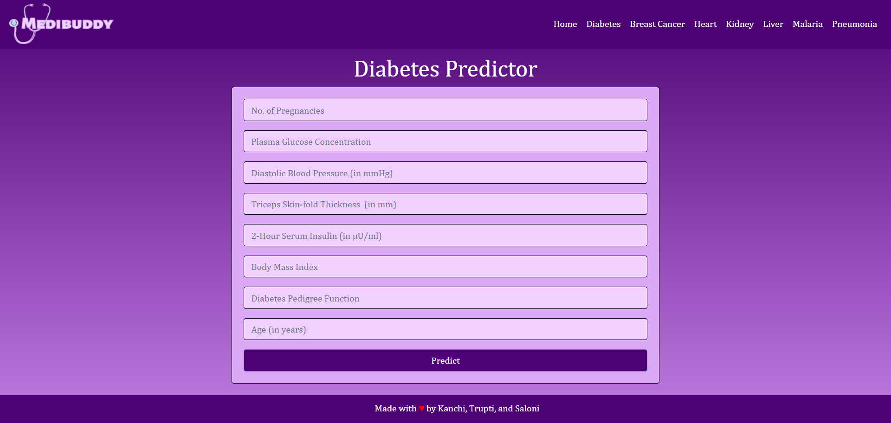
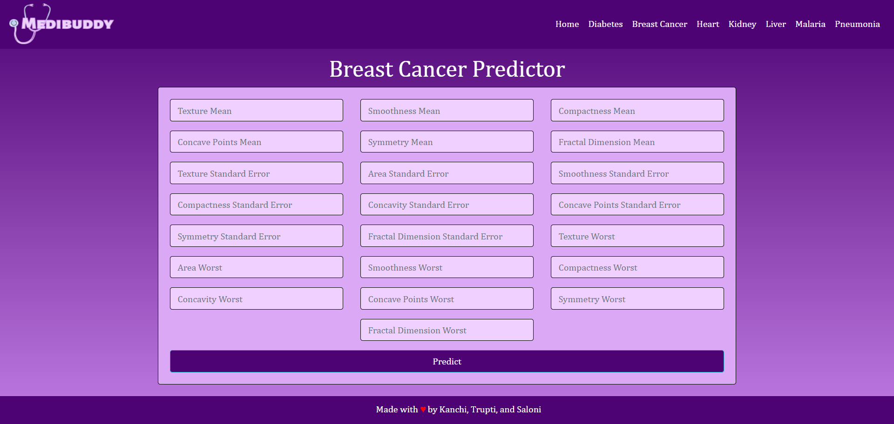
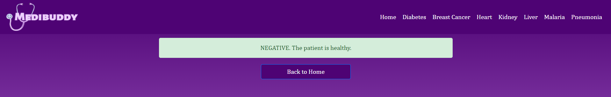

# Medibuddy: Smart Disease Predictor

## Sample images of the web application

### Home Page

 

### Diabetes Predictor

 

### Breast Cancer Predictor

 

### Malaria Predictor

 

### Negative Result Page

 

### Positive Result Page

